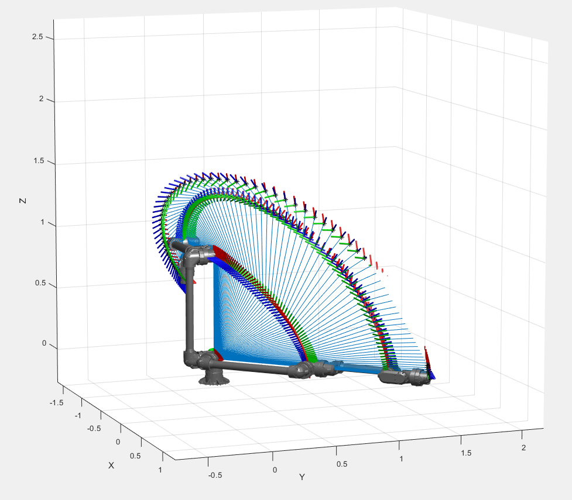

(C) 2021 Airbus Defence and Space. Licensed under Apache 2.0


<p align="left">
    <a href="#License" alt="License">
        </a>
    <a href="#Release" alt="Release Cycle Type">
        </a>
    <a href="#Version" alt="Version">
        </a> 

</p>

       
# VISPA Description [](https://twitter.com/intent/tweet?text=Try%20out%20VISPA%20a%20space%20robotic%20arm%20for%20next%20gen%20space!&url=https://www.github.com/AirbusDefenceAndSpace/vispa&via=AirbusSpace&hashtags=vispa,robotic,urdf,space)


This collection of files and folders containing the necessary information to visualise and simulate the Versatile In-Space and Planetary Arm (VISPA). At the heart of the description package is the Unified Robot Description Format (URDF) that is commonly utalised in robotics to represent a robot model in the XML format. 

- [VISPA Description](#vispa-description)
  - [Folder Structure](#folder-structure)
    - [urdf](#urdf)
    - [meshes](#meshes)
    - [rviz](#rviz)
    - [launch](#launch)
  - [Viewing Model](#viewing-model)
    - [ROS 2 (distro foxy)](#ros-2-distro-foxy)
    - [ROS 1 (distro kinetic)](#ros-1-distro-kinetic)
    - [CoppeliaSim (Version 4.2)](#coppeliasim-version-42)
    - [Matlab](#matlab)
  - [Caveats](#caveats)
  - [TODO](#todo)

## Folder Structure

```
vispa_description
|   README.md
|   CMakeLists.txt
|   package.xml
|
└─ images
|       coppeliasim_vispa.png
|	...
└─ launch
|      display.launch
|      display.launch.py
└─ meshes
|       Link0_DHReference-PublicRelease.stl
|       Link0_DHReference-PublicRelease-col.stl
|       ...
|       Link6_DHReference-PublicRelease.stl
|	Link6_DHReference-PublicRelease-col.stl
└─ rviz
|       vispa_ros1.rviz
|       vispa_ros2.rviz
└─ urdf
        VISPA_modifiedDH.urdf
	VISPA_modifiedDH_Ros2.urdf
        

```  
### urdf 
This folder contains the URDF file (VISPA_modifiedDH.urdf) that describes the robotic arm characteristics, and links to CAD data. 

### meshes

Stores the CAD files for sections for the arm in STL format. Each section has two corresponding files; one for visulaisation and one for collision checking algorithms. The colision check STL files are smaller in size to allow quicker processing this is achieved by decimating the mesh. 

### rviz

Setting files to view the model in the Robotic Operation System (ROS) visualisation tool (RViz). ROS has two 'main' versions, ROS1 and ROS2, with subsequent two versions of Rviz. 

### launch

ROS works by using started scripts or launch files start 'nodes'. The launch folder contains launch files for ROS1 and ROS2. ROS2 uses python instead of the previous custom .launch file type.

## Viewing Model

### ROS 2 (distro foxy + Ubuntu 18.04 LTS)

This was tested on Ubuntu 18.04LTS with the ROS2 Foxy version. The following assumes Ros2 is already installed, if not then the webpage - https://docs.ros.org/en/dashing/Installation/Ubuntu-Install-Binary.html - is proably a good starting point to understanding how to install it. 

Start by cloning the vispa repo to a suitable location.

```bash
git clone https://github.com/AirbusDefenceAndSpace/vispa.git
cd vispa
```

Then build the package using the following two commands. The author used the Zsh command shell, if using another one for instance, Bash, then change the suffix on 'setup.' to what is appropriate. 

```bash
colcon build
. install/setup.zsh 
```
Then launch the rviz viewer that hopefully should load the Vispa Urdf and provide a small gui to control joint positions.

```bash
ros2 launch vispa display.launch.py 
```


### ROS 1 (distro kinetic)

This is the basic command to get the model to run with the original rviz, but no gurantees on this...

```bash
roslaunch urdf_tutorial display.launch model:=src/vispa_description/vispa.urdf gui:=True 
```

### CoppeliaSim (Version 4.2 + Windows 10)

CoppeliaSim is a robotic simulator used in industry and academia. This was tested on version 4.2 in Windows 10. I used git bash to perform the clone but other methods in windows are available.

```bash
git clone https://github.com/AirbusDefenceAndSpace/vispa.git
cd vispa
```

Start CoppeliaSim and select 'Plugins -> URDF Importer'

Navigate to the **VISPA_modifiedDH_CoppeliaSim.urdf** file in the `vispa/urdf` folder and select. It will then take a few moments to import.


### Matlab

An example matlab script is included (matlab_import.mat) that loads the URDF, generates a simple trajectory, and generates some simple plots of joint data. 



## Caveats

1) Important into ROS using ROS2; have in the past used ROS1 but at this stage unable to document the exact proceedure. 
2) CAD STL models might need to be reduced in size as load times is larger than normal expected.

## TODO

