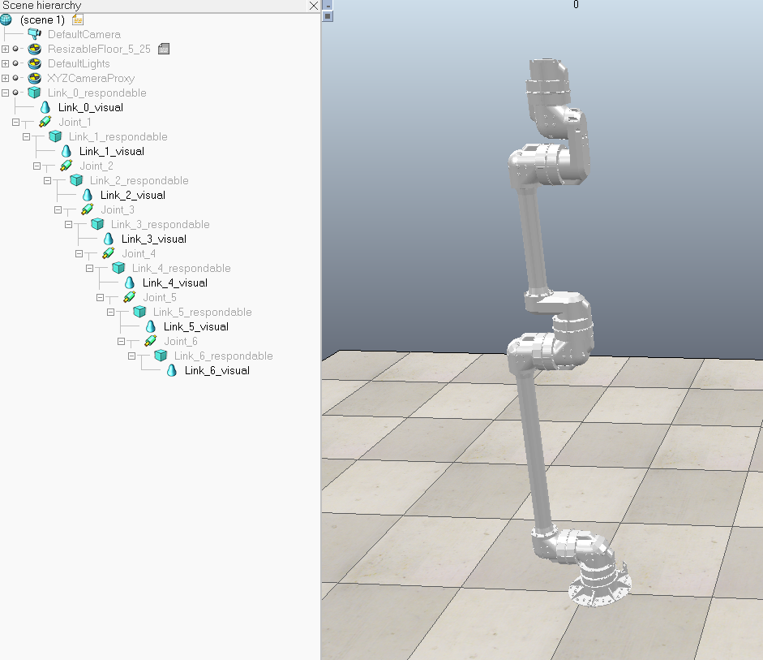

(C) 2021 Airbus Defence and Space. Licensed under Apache 2.0


<p align="left">
    <a href="#License" alt="License">
        </a>
    <a href="#Release" alt="Release Cycle Type">
        </a>
    <a href="#Version" alt="Version">
        </a> 
</p>

# VISPA Description

This collection of files and folders containing the necessary information to visualise and simulate the Versatile In-Space and Planetary Arm (VISPA). Previously it was named LOCARM, and for easy of reference the names for the short term can informally be used interchangably. At the heart of the description package is the Unified Robot Description Format (URDF) that is commonly utalised in robotics to represent a robot model in the XML format. 

- [VISPA Description](#vispa-description)
  - [Folder Structure](#folder-structure)
    - [urdf](#urdf)
    - [meshes](#meshes)
    - [rviz](#rviz)
    - [launch](#launch)
  - [Viewing Model](#viewing-model)
    - [ROS 2 (distro foxy)](#ros-2-distro-foxy)
    - [ROS 1 (distro kinetic)](#ros-1-distro-kinetic)
    - [CoppeliaSim (Version 4.2)](#coppeliasim-version-42)
    - [Matlab](#matlab)
  - [Caveats](#caveats)
  - [TODO](#todo)

## Folder Structure

```
vispa_description
|   README.md
|   CMakeLists.txt
|   package.xml
|
└─ images
|       coppeliasim_vispa.png
└─ launch
|      display.launch
|      display.launch.py
└─ meshes
|       LINK_0.stl
|       LINK_0._col.stl
|       ...
|       LINK_BASE_col.stl
└─ rviz
|       vispa_ros1.rviz
|       vispa_ros2.rviz
└─ urdf
        vispa.urdf
        vispa.xacro
        README.md

```  
### urdf 
This folder contains the URDF file (vispa.urdf) that describes the robotic arm characteristics, and links to CAD data. However this file isn't directly created by an engineer, it is actually generated from a secondary file **vispa.xacro**. Xacro format has a more modular format that allows for shorter and more readable constructs. The urdf is already generated, but to synthesize it again the README.md within the urdf folder provides instructions.

### meshes

Stores the CAD files for sections for the arm in STL format. Each section has two corresponding files; one for visulaisation and one for collision checking algorithms. The colision check STL files are smaller in size to allow quicker processing this is achieved by decimating the mesh. 

### rviz

Setting files to view the model in the Robotic Operation System (ROS) visulaisation tool (RViz). ROS has two 'main' versions, ROS1 and ROS2, with subsequent two versions of Rviz. 

### launch

ROS works by using started scripts or launch files start 'nodes'. The launch folder contains launch files for ROS1 and ROS2. ROS2 uses python instead of the previous custom .launch file type.

## Viewing Model

### ROS 2 (distro foxy)

```bash
mkdir -p ws/src
```

Copy vispa_description to src folder.

```bash
cd ws
colcon build
. install/setup.zsh 
```
```bash
. install/setup.zsh 

```

```bash
ros2 launch vispa_description display.launch.py 
```


### ROS 1 (distro kinetic)

This is the basic command to get the model to run with the original rviz, but can't give gurantees on this...

```bash
roslaunch urdf_tutorial display.launch model:=src/vispa_description/vispa.urdf gui:=True 
```

### CoppeliaSim (Version 4.2)

Add-ons > URDF Importer

Navigate to the vispa.urdf file and select. It will then take a few moments to import.



### Matlab

Matlab importing is currently not possible and is currently under investigation. Once working it will require a
Robotics System Toolbox license from MathWorks is required to create RigidBodyTree objects

## Caveats

1) CAD data is taken from an older version of VISPA/LOCARM, however the difference between this in terms of 'looks' and the latest CAD is relatively minor. This was used as it was a readily available STL files, future updates will feature a more modern design.
2) The centres of rotation between segments was done 'by eye' and not using a parameteric CAD tool to provide actual measurements, this will be addressed in future updates.
3) Importing the URDF into Matlab was attempted but failed, auther is currently unsure of the issue. Possible down to lack of a particular matlab add-on.
4) Important into ROS using ROS2; have in the past used ROS1 but at this stage unable to document the exact proceedure. 
5) CAD STL models might need to be reduced in size as load times is larger than normal expected.

## TODO

- [ ] Add texture to CAD
- [ ] Need to updated inertia data for the joints, in CoppeliaSim the physics work 'okay' but could be better.
- [ ] Get model to import into Matlab and unity correctly.
